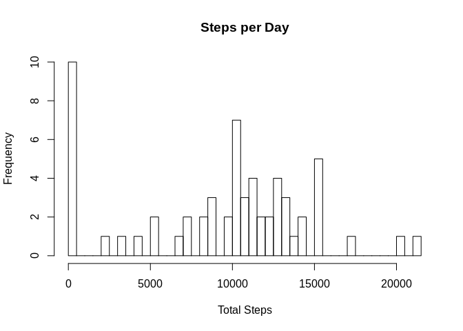
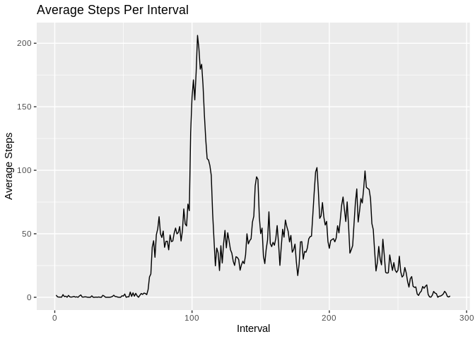
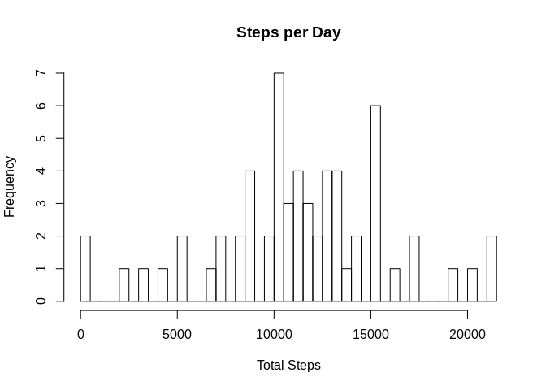
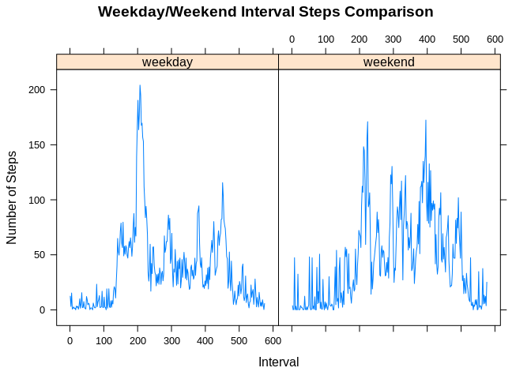

Project 1 - Goals
-----------------

This is an R Markdown document containing the code and documentation
required for evaluating activity monitoring data. The dataset contains
data reflecting the number of steps taken during five minute intervals,
plus the data and interval the data was collected.

With this data, we are required to generate an R Markdown document
containing the following:  
1. Code for reading in the dataset and/or processing the data  
2. Histogram of the total number of steps taken each day  
3. Mean and median number of steps taken each day  
4. Time series plot of the average number of steps taken  
5. The 5-minute interval that, on average, contains the maximum number
of steps  
6. Code to describe and show a strategy for imputing missing data  
7. Histogram of the total number of steps taken each day after missing
values are imputed  
8. Panel plot comparing the average number of steps taken per 5-minute
interval across weekdays and weekends  
9. All of the R code needed to reproduce the results (numbers, plots,
etc.) in the report

    # Load libraries required for project
    library(UsingR)
    library(lubridate)
    library(stringr)
    library(dplyr)
    library(ggplot2)
    library(mlr)
    #install.packages("BBmisc")
    library(BBmisc)
    #install.packages("mice")
    library(mice)
    library(gridExtra)
    library(caTools)
    library(httpuv)

### Reading in the data set

    data_loc <- "./activity.csv" 
    data <- read.csv(data_loc)                       # Read in the data
    data$date <- as.Date(as.character(data$date))    # Set date type

### Generate histogram of the total number of steps taken each day

    grouped <- group_by(data, date)                  # group rows by date
    group_sums <- summarize(grouped, 
                   tot_steps=sum(steps, na.rm=TRUE)) # Determine total steps per day
    steps <- group_sums$tot_steps                    # short name for total steps
    len <- length(unique(steps))                     # get number of step values     
    hist(steps, breaks = len, main = "Steps per Day", 
         xlab = "Total Steps")                       # Create histogram of step values

### Show mean and median number of steps taken each day

    Mean   <- format(mean(steps, na.rm=TRUE), nsmall=2) # compute mean and median
    Median <- format(median(steps, na.rm=TRUE), nsmall=2)

#### The mean number of steps per day is 9354.23, and the median is 10395.

### Time series plot of the average number of steps taken

    data$interval <- as.factor(data$interval)           # set intervals as factors
    grouped <- group_by(data, interval)                 # group by collection interval
    stats <- summarize(grouped, ave_steps=mean(steps, na.rm=TRUE)) # compute means per interval
    ggplot(stats, aes(x=1:length(stats$ave_steps), y=ave_steps)) + geom_line() + 
      ggtitle("Average Steps Per Interval") + xlab("Interval")  + ylab("Average Steps")

### Show the 5-minute interval that, on average, contains the maximum number of steps

    Max <- data[which.max(stats$ave_steps),]            # find the row with the max ave steps     
    interval <- as.character(Max$interval)              # get the interval value
    interval <- paste(substring(interval,1,1),":", 
                      substring(interval,2,3), sep="")  # format for printing

#### The five minute interval that contained the maximum number of steps was at 8:35.

### Code to describe and show a strategy for imputing missing data

    # extract two character strings from character vector
    splt <- function(vec, start) {
        tmp <- sapply(t, function(i) substr(i,start,start+1))
        tmp <- as.integer(tmp)
        tmp
    }

    # scale (mean = 0, sd = 1) specified columns in table
    scale_nums <- function(df, cols=c("hr", "mn", "yday")) {
      for(col in cols) {
        df[,col] <- as.numeric(scale(df[,col]))
      }
      df
    }

    data <- read.csv(data_loc)                     # Read in original data
    data$yday <- as.POSIXlt(data$date)$yday        # extract day of year (1:365) value

    t <- str_pad(as.character(data$interval), 
                 4, pad="0")                       # extract hour and minute
    data$hr <- splt(t,1)                           # values from interval
    data$mn <- splt(t,3)

    data2 <- data[c("steps", "hr", "mn", "yday")]  # select steps, hour, minute & year-day
    data2 <- scale_nums(data2, cols=c("hr", "mn", "yday")) # Normalize columns

    tempData <- mice(data=data2, m=5, 
                     meth='pmm',seed=500)          # Impute missing values

    ## 
    ##  iter imp variable
    ##   1   1  steps
    ##   1   2  steps
    ##   1   3  steps
    ##   1   4  steps
    ##   1   5  steps
    ##   2   1  steps
    ##   2   2  steps
    ##   2   3  steps
    ##   2   4  steps
    ##   2   5  steps
    ##   3   1  steps
    ##   3   2  steps
    ##   3   3  steps
    ##   3   4  steps
    ##   3   5  steps
    ##   4   1  steps
    ##   4   2  steps
    ##   4   3  steps
    ##   4   4  steps
    ##   4   5  steps
    ##   5   1  steps
    ##   5   2  steps
    ##   5   3  steps
    ##   5   4  steps
    ##   5   5  steps

    data3 <- complete(tempData,1)                  # get data with imputed values   
    data4 <- data[, c("steps", "date", "interval")]# get original data columns
    data4$steps <- data3$steps                     # Insert imputed values into data   

The data is re-read to include missing step values. The date values are
converted to integers representing the day of the year (yday), and the
converted dates and interval values are normalized. The steps, interval
and year-day (yday) values are passed to the mice algorithm
(<a href="https://cran.r-project.org/web/packages/mice/mice.pdf" class="uri">https://cran.r-project.org/web/packages/mice/mice.pdf</a>),
and the missing step values are imputed using the Predictive mean
matching algorithm. Once missing values are imputed, the step values in
the original table are replaced with the processed step values.

### View of some formerly missing values

    head(data4, n=10)                               # show that initial NAs are filled

    ##    steps       date interval
    ## 1      0 2012-10-01        0
    ## 2      0 2012-10-01        5
    ## 3      0 2012-10-01       10
    ## 4      0 2012-10-01       15
    ## 5      0 2012-10-01       20
    ## 6      0 2012-10-01       25
    ## 7      0 2012-10-01       30
    ## 8      0 2012-10-01       35
    ## 9      0 2012-10-01       40
    ## 10     0 2012-10-01       45

Histogram of the total number of steps taken each day after missing values are imputed
--------------------------------------------------------------------------------------

    grouped <- group_by(data4, date)                 # group rows by date
    group_sums <- summarize(grouped, 
                   tot_steps=sum(steps, na.rm=TRUE)) # Determine total steps per day
    steps <- group_sums$tot_steps                    # short name for total steps
    len <- length(unique(steps))                     # get number of step values     
    hist(steps, breaks = len, main = "Steps per Day", 
         xlab = "Total Steps")                       # Create histogram of step values

Panel plot comparing the average number of steps taken per 5-minute interval across weekdays and weekends
---------------------------------------------------------------------------------------------------------

    wday <- as.POSIXlt(data4$date)                              # Get date value
    data4$wday <- wday$wday                                     # extract weekday value
    data4$day_type <- "weekday"                                 # Set day type
    data4[(data4$wday==0| data4$wday==6),"day_type"] <- "weekend"
    data4$day_type <- as.factor(data4$day_type)                 # set grouping factors
    data4$interval <- as.factor(data4$interval)
    grouped <- group_by(data4, interval, day_type)              # group by interval and day_type
    means <- summarise(grouped, ave=mean(steps))                # get mean for each interval and day type
    xyplot(ave~1:length(means$ave)|day_type, means, type="l", 
           main="Weekday/Weekend Interval Steps Comparison", xlab="Interval", ylab="Number of Steps")

